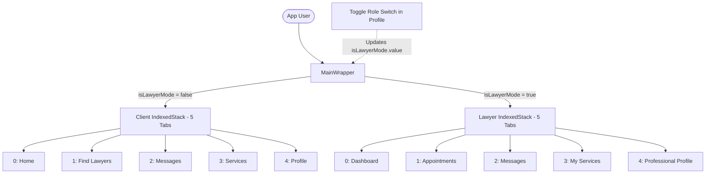

# ⚖️ AinBondhu (আইনবন্ধু) - Legal Services Mobile Application

[](https://flutter.dev)
[](https://dart.dev)
[](https://pub.dev/packages/get)
[](https://flutter.dev)
[](https://dart.dev/tools/analysis)

> **ন্যায়ের পথে আপনার বিশ্বস্ত বন্ধু!**  
> An on-demand legal services mobile platform connecting citizens and businesses with verified legal professionals in Bangladesh.

---

## 📖 Overview

**AinBondhu (আইনবন্ধু)** is a bilingual (Bengali-first) mobile application engineered with Flutter and GetX. The application solves accessibility, transparency, and friction in seeking legal aid in Bangladesh by providing a unified digital marketplace for legal advice, consultations, and document drafting.

The application features a unique **Dual-Mode Architecture** allowing seamless switching between **Client Mode (নাগরিক/গ্রাহক)** and **Lawyer Mode (আইনজীবী/পেশাদার)** within a single installation.

---

## ✨ Key Features

### 👤 1. Client / Citizen Mode (গ্রাহক সেবা)
* **Interactive Home Dashboard:**
  * Promotional hero banner carousel with quick action triggers.
  * Direct access to legal categories: চুক্তিপত্র (Contracts), ট্রেডমার্ক (Trademark), কর ও হিসাব (Tax & Accounting), নোটারি (Notarization), and সম্পত্তি (Property Law).
  * Top-rated lawyers spotlight and emergency legal assistance helpline.
* **Lawyer Discovery & Search:**
  * Search lawyers by name, specialty, or court jurisdiction.
  * Detailed lawyer profiles displaying bio, experience, winning rate, case history, ratings, and consultation rates.
* **Legal Services & Multi-Step Booking:**
  * Browse categorized legal packages (Basic, Standard, Premium).
  * 3-step service request pipeline:
    1. **Applicant Information & File Attachment:** Document picker supporting PDF/doc uploads.
    2. **Review & Cost Breakdown:** Verification of package details and fees.
    3. **Confirmation:** Real-time request dispatch to the designated lawyer.
* **Consultation Booking:** Schedule video, audio, or in-person consultation appointments with selected legal experts.
* **Appointment Tracking:** Monitor pending, confirmed, and completed appointments with detailed status badges.
* **In-App Messaging:** Conversational chat interface featuring search, unread message badges, and an integrated Bengali emoji keyboard.
* **User Profile & Settings:** Manage personal identity details, view payment history, and configure notification/privacy preferences.

---

### ⚖️ 2. Lawyer / Professional Mode (আইনজীবী ড্যাশবোর্ড)
* **Practice Analytics Dashboard:** Real-time metrics tracking total consultations, pending reviews, active case files, and overall ratings.
* **Appointment Management:** Review consultation requests with one-tap status updates (Confirm, Reschedule, or Decline).
* **Service Requests Management:** Filter and review incoming client service requests with full case description and attached documents.
* **Service Offerings Management:** Add and manage custom legal service packages with pricing tiers.
* **Professional Profile:** Showcase Bar Council registration number, practice areas, certifications, awards, and credentials.

---

## 🔄 Dual-Mode Switching Mechanism

AinBondhu uses a unified controller pattern managed by `UserProfileController`:



All 5 tabs for both personas are held in memory using `IndexedStack` to maintain scroll position and form state between tab switches.

---

## 🏗️ Project Architecture & Folder Structure

```
lib/
├── controllers/            # GetX Controllers (State Management & Logic)
│   ├── chat_controller.dart
│   ├── consultation_controller.dart
│   ├── home_controller.dart
│   ├── lawyer_appointment_controller.dart
│   ├── lawyer_home_controller.dart
│   ├── lawyer_my_services_controller.dart
│   ├── lawyer_profile_controller.dart
│   ├── lawyer_search_controller.dart
│   ├── lawyer_service_details_controller.dart
│   ├── lawyer_service_requests_controller.dart
│   ├── login_controller.dart
│   ├── nav_controller.dart
│   ├── payment_controller.dart
│   ├── professional_profile_controller.dart
│   ├── requested_appointments_controller.dart
│   ├── service_booking_controller.dart
│   ├── service_detail_controller.dart
│   ├── service_list_controller.dart
│   ├── service_search_controller.dart
│   ├── settings_controller.dart
│   ├── signup_controller.dart
│   └── user_profile_controller.dart
│
├── models/                 # Data Models & Schemas
│   ├── auth_request_models.dart
│   ├── consultation_model.dart
│   ├── lawyer_model.dart
│   ├── lawyer_profile_model.dart
│   ├── lawyer_service_model.dart
│   ├── lawyer_side_model.dart
│   ├── requested_appointment_model.dart
│   └── user_model.dart
│
├── screens/                # UI Presentation Layer (28 Screens)
│   ├── appointment_detail_screen.dart
│   ├── auth_selection_screen.dart
│   ├── chat_detail_screen.dart
│   ├── chat_list_screen.dart
│   ├── consultation_screen.dart
│   ├── home_screen.dart
│   ├── intro_screen.dart
│   ├── lawyer_appointment_screen.dart
│   ├── lawyer_home_screen.dart
│   ├── lawyer_main_profile_screen.dart
│   ├── lawyer_my_services_screen.dart
│   ├── lawyer_profile_screen.dart
│   ├── lawyer_search_screen.dart
│   ├── lawyer_service_details_screen.dart
│   ├── lawyer_service_requests_screen.dart
│   ├── login_screen.dart
│   ├── payment_history.dart
│   ├── professional_profile_screen.dart
│   ├── profile_edit_screen.dart
│   ├── requested_appointment_details.dart
│   ├── requested_appointments_screen.dart
│   ├── search_service_screen.dart
│   ├── service_booking_screen.dart
│   ├── service_detail_screen.dart
│   ├── service_list_screen.dart
│   ├── service_search_screen.dart
│   ├── signup_screen.dart
│   ├── splash_screen.dart
│   └── user_profile_screen.dart
│
├── settings/               # App Settings Screens
│   ├── notification_settings_screen.dart
│   ├── privacy_settings_screen.dart
│   └── settings_screen.dart
│
├── utils/                  # Styling & Navigation Routing
│   ├── app_colors.dart     # Brand Palette (Deep Green, Golden, Accent Blues)
│   └── routes.dart         # GetPage Route Configurations
│
├── widgets/                # Core Shell & Reusable Widgets
│   ├── custom_drawer.dart  # Frosted Glass Modal Drawer
│   ├── custom_nav_bar.dart # Dynamic Dual-Mode Bottom Navigation Bar
│   └── main_wrapper.dart   # Dual-Mode IndexedStack Shell
│
└── main.dart               # App Bootstrap & Theme Configuration
```

---

## 🚀 Getting Started

### Prerequisites
* [Flutter SDK](https://docs.flutter.dev/get-started/install) (`^3.8.1` / Flutter 3.27+)
* [Dart SDK](https://dart.dev/get-dart)
* Android Studio / VS Code with Flutter extension
* An active Android Emulator, iOS Simulator, or physical device

### Installation & Run

1. **Clone the repository:**
   ```bash
   git clone https://github.com/your-username/Ainbondhu_Mobile_Application_Flutter.git
   cd Ainbondhu_Mobile_Application_Flutter
   ```

2. **Install dependencies:**
   ```bash
   flutter pub get
   ```

3. **Verify static analysis:**
   ```bash
   flutter analyze
   ```
   *(Expected output: `No issues found!`)*

4. **Run unit & widget tests:**
   ```bash
   flutter test
   ```

5. **Launch the application:**
   ```bash
   flutter run
   ```

---

## 🔐 Demo / Test Credentials

The authentication module currently simulates real backend authentication by comparing credentials against `assets/data/user_mock.json`:

| Field | Value |
|---|---|
| **Email** | `test@lawbuddy.com` |
| **Password** | `password123` |
| **Role Toggle** | Switch directly between Citizen and Lawyer in the **Profile (প্রোফাইল)** tab |

---

## 🎨 Design System & Typography

* **Primary Colors:**
  * Forest Green: `#196420` / `#1B5E20`
  * Warm Golden: `#C1902D`
  * Text Contrast: `#111827` (Heading), `#4B5563` (Subheading)
* **Typography:** [Google Fonts: Anek Bangla](https://fonts.google.com/specimen/Anek+Bangla) configured globally through `ThemeData.textTheme`.

---

## 🛠️ Code Quality & Refactoring Summary

The codebase has undergone a full audit and cleanup:
* **Resolved 78 Analysis Issues:** Fixed all deprecated Flutter 3.27+ methods (`withOpacity` updated to `withValues(alpha: ...)`, `activeColor` updated to `activeThumbColor`, `value` updated to `initialValue`).
* **Cleaned Dead Code:** Removed unreferenced methods (`_buildNavItem`, `_buildDrawerItem`), unused imports, and empty 0-byte placeholder files.
* **Normalized Routes:** Renamed `lawyer_search` route identifier to idiomatic `lawyerSearch`.
* **Zero Linter Warnings:** `flutter analyze` runs with **0 errors, 0 warnings, 0 infos**.

---

## 🗺️ Roadmap & Next Steps

- [ ] **REST API Integration:** Connect to a live backend using `dio` with JWT authentication and refresh tokens.
- [ ] **Local Persistence:** Integrate `get_storage` or `shared_preferences` to persist authentication state and user role selection across app restarts.
- [ ] **Real-time Messaging:** Connect `ChatController` to Firebase Firestore or WebSockets for live peer-to-peer messaging.
- [ ] **Payment Gateway:** Integrate Bangladeshi payment providers (bKash, Nagad, Rocket, SSLCommerz) into `PaymentController`.
- [ ] **Asset Compression:** Compress bundled raster graphics to WebP to reduce overall APK/IPA bundle size.

---

## 📄 License

This project is licensed under the MIT License - see the LICENSE file for details.
